# Combolands Assets

A browsable, structured snapshot of Combolands game data and visual references.

- [`assets/`](assets/) contains extracted and procedurally reconstructed visual assets.
- [`data/`](data/) contains normalized entity, mechanic, and enum records.
- [`manifest.json`](manifest.json) is the machine-readable catalog index.
- [`primer/agent-cheatsheet.md`](primer/agent-cheatsheet.md) summarizes the catalog's mechanics and relationships.

Each directory under [`assets/buildings/`](assets/buildings/) has its own README with the building description, basic mechanics, primary card images, related entries, and links to its available terrain, paint, animation, and sprite variants.

## Buildings by guild

Buildings are grouped by their primary category. Neutral also includes records whose primary category is `none`; these are the catalog's no-guild buildings. Alternate states remain separate entries when the game data represents them separately.

### Agricultural

<table>
  <tbody>
    <tr>
      <td align="center" width="16.66%">
        <a href="assets/buildings/apiary/">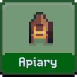</a> 
        <a href="assets/buildings/apiary/"><strong>Apiary</strong></a>
      </td>
      <td align="center" width="16.66%">
        <a href="assets/buildings/composter/">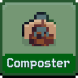</a> 
        <a href="assets/buildings/composter/"><strong>Composter</strong></a>
      </td>
      <td align="center" width="16.66%">
        <a href="assets/buildings/sheep-farm/">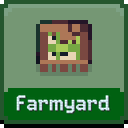</a> 
        <a href="assets/buildings/sheep-farm/"><strong>Farmyard</strong></a>
      </td>
      <td align="center" width="16.66%">
        <a href="assets/buildings/apple-orchard/">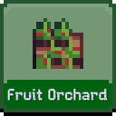</a> 
        <a href="assets/buildings/apple-orchard/"><strong>Fruit Orchard</strong></a>
      </td>
      <td align="center" width="16.66%">
        <a href="assets/buildings/apple-orchard-empty/">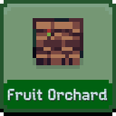</a> 
        <a href="assets/buildings/apple-orchard-empty/"><strong>Fruit Orchard</strong></a>
      </td>
      <td align="center" width="16.66%">
        <a href="assets/buildings/gardeners-cottage/">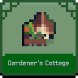</a> 
        <a href="assets/buildings/gardeners-cottage/"><strong>Gardener&#x27;s Cottage</strong></a>
      </td>
    </tr>
    <tr>
      <td align="center" width="16.66%">
        <a href="assets/buildings/grain-silo/">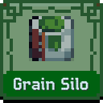</a> 
        <a href="assets/buildings/grain-silo/"><strong>Grain Silo</strong></a>
      </td>
      <td align="center" width="16.66%">
        <a href="assets/buildings/granary/">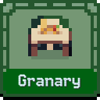</a> 
        <a href="assets/buildings/granary/"><strong>Granary</strong></a>
      </td>
      <td align="center" width="16.66%">
        <a href="assets/buildings/harvester/">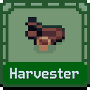</a> 
        <a href="assets/buildings/harvester/"><strong>Harvester</strong></a>
      </td>
      <td align="center" width="16.66%">
        <a href="assets/buildings/irrigation/">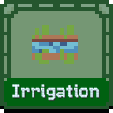</a> 
        <a href="assets/buildings/irrigation/"><strong>Irrigation</strong></a>
      </td>
      <td align="center" width="16.66%">
        <a href="assets/buildings/manure/">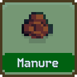</a> 
        <a href="assets/buildings/manure/"><strong>Manure</strong></a>
      </td>
      <td align="center" width="16.66%">
        <a href="assets/buildings/berry-picker/">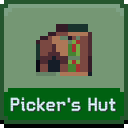</a> 
        <a href="assets/buildings/berry-picker/"><strong>Picker&#x27;s Hut</strong></a>
      </td>
    </tr>
    <tr>
      <td align="center" width="16.66%">
        <a href="assets/buildings/barn/">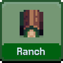</a> 
        <a href="assets/buildings/barn/"><strong>Ranch</strong></a>
      </td>
      <td align="center" width="16.66%">
        <a href="assets/buildings/reservoir/">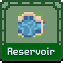</a> 
        <a href="assets/buildings/reservoir/"><strong>Reservoir</strong></a>
      </td>
      <td align="center" width="16.66%">
        <a href="assets/buildings/scarecrow/">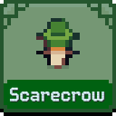</a> 
        <a href="assets/buildings/scarecrow/"><strong>Scarecrow</strong></a>
      </td>
      <td align="center" width="16.66%">
        <a href="assets/buildings/sunflower-farm/">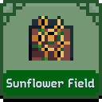</a> 
        <a href="assets/buildings/sunflower-farm/"><strong>Sunflower Field</strong></a>
      </td>
      <td align="center" width="16.66%">
        <a href="assets/buildings/sunflower-farm-empty/">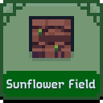</a> 
        <a href="assets/buildings/sunflower-farm-empty/"><strong>Sunflower Field</strong></a>
      </td>
      <td align="center" width="16.66%">
        <a href="assets/buildings/wheat-field/">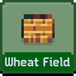</a> 
        <a href="assets/buildings/wheat-field/"><strong>Wheat Field</strong></a>
      </td>
    </tr>
    <tr>
      <td align="center" width="16.66%">
        <a href="assets/buildings/wheat-field-empty/">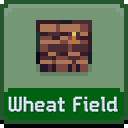</a> 
        <a href="assets/buildings/wheat-field-empty/"><strong>Wheat Field</strong></a>
      </td>
      <td align="center" width="16.66%">
        <a href="assets/buildings/windmill/">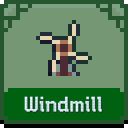</a> 
        <a href="assets/buildings/windmill/"><strong>Windmill</strong></a>
      </td>
    </tr>
  </tbody>
</table>

### Industrial

<table>
  <tbody>
    <tr>
      <td align="center" width="16.66%">
        <a href="assets/buildings/blacksmith/">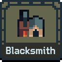</a> 
        <a href="assets/buildings/blacksmith/"><strong>Blacksmith</strong></a>
      </td>
      <td align="center" width="16.66%">
        <a href="assets/buildings/carpenter/">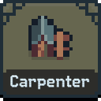</a> 
        <a href="assets/buildings/carpenter/"><strong>Carpenter</strong></a>
      </td>
      <td align="center" width="16.66%">
        <a href="assets/buildings/depot/">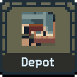</a> 
        <a href="assets/buildings/depot/"><strong>Depot</strong></a>
      </td>
      <td align="center" width="16.66%">
        <a href="assets/buildings/factory/">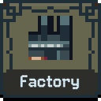</a> 
        <a href="assets/buildings/factory/"><strong>Factory</strong></a>
      </td>
      <td align="center" width="16.66%">
        <a href="assets/buildings/lumberyard/">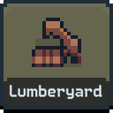</a> 
        <a href="assets/buildings/lumberyard/"><strong>Lumberyard</strong></a>
      </td>
      <td align="center" width="16.66%">
        <a href="assets/buildings/mine/">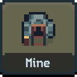</a> 
        <a href="assets/buildings/mine/"><strong>Mine</strong></a>
      </td>
    </tr>
    <tr>
      <td align="center" width="16.66%">
        <a href="assets/buildings/nitrary/">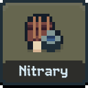</a> 
        <a href="assets/buildings/nitrary/"><strong>Nitrary</strong></a>
      </td>
      <td align="center" width="16.66%">
        <a href="assets/buildings/outpost/">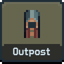</a> 
        <a href="assets/buildings/outpost/"><strong>Outpost</strong></a>
      </td>
      <td align="center" width="16.66%">
        <a href="assets/buildings/quarry/">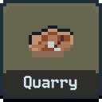</a> 
        <a href="assets/buildings/quarry/"><strong>Quarry</strong></a>
      </td>
      <td align="center" width="16.66%">
        <a href="assets/buildings/sawmill/">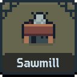</a> 
        <a href="assets/buildings/sawmill/"><strong>Sawmill</strong></a>
      </td>
      <td align="center" width="16.66%">
         
        <a href="assets/buildings/shanty-town/"><strong>Slums</strong></a>
      </td>
      <td align="center" width="16.66%">
        <a href="assets/buildings/smelter/">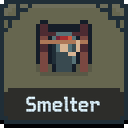</a> 
        <a href="assets/buildings/smelter/"><strong>Smelter</strong></a>
      </td>
    </tr>
    <tr>
      <td align="center" width="16.66%">
        <a href="assets/buildings/stockpile/">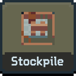</a> 
        <a href="assets/buildings/stockpile/"><strong>Stockpile</strong></a>
      </td>
      <td align="center" width="16.66%">
        <a href="assets/buildings/tool-shed/">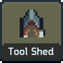</a> 
        <a href="assets/buildings/tool-shed/"><strong>Tool Shed</strong></a>
      </td>
      <td align="center" width="16.66%">
        <a href="assets/buildings/workshop/">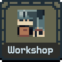</a> 
        <a href="assets/buildings/workshop/"><strong>Workshop</strong></a>
      </td>
    </tr>
  </tbody>
</table>

### Martial

<table>
  <tbody>
    <tr>
      <td align="center" width="16.66%">
        <a href="assets/buildings/university/">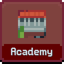</a> 
        <a href="assets/buildings/university/"><strong>Academy</strong></a>
      </td>
      <td align="center" width="16.66%">
        <a href="assets/buildings/archery-range/">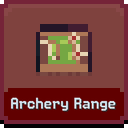</a> 
        <a href="assets/buildings/archery-range/"><strong>Archery Range</strong></a>
      </td>
      <td align="center" width="16.66%">
        <a href="assets/buildings/arsenal/">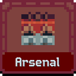</a> 
        <a href="assets/buildings/arsenal/"><strong>Arsenal</strong></a>
      </td>
      <td align="center" width="16.66%">
        <a href="assets/buildings/ballista/">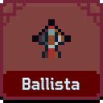</a> 
        <a href="assets/buildings/ballista/"><strong>Ballista</strong></a>
      </td>
      <td align="center" width="16.66%">
        <a href="assets/buildings/banner/">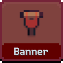</a> 
        <a href="assets/buildings/banner/"><strong>Banner</strong></a>
      </td>
      <td align="center" width="16.66%">
        <a href="assets/buildings/barracks/">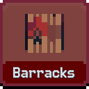</a> 
        <a href="assets/buildings/barracks/"><strong>Barracks</strong></a>
      </td>
    </tr>
    <tr>
      <td align="center" width="16.66%">
        <a href="assets/buildings/effigy-pyre/">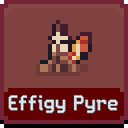</a> 
        <a href="assets/buildings/effigy-pyre/"><strong>Effigy Pyre</strong></a>
      </td>
      <td align="center" width="16.66%">
        <a href="assets/buildings/field-hospital/">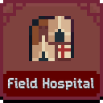</a> 
        <a href="assets/buildings/field-hospital/"><strong>Field Hospital</strong></a>
      </td>
      <td align="center" width="16.66%">
        <a href="assets/buildings/fortress/">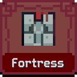</a> 
        <a href="assets/buildings/fortress/"><strong>Fortress</strong></a>
      </td>
      <td align="center" width="16.66%">
        <a href="assets/buildings/galleon/">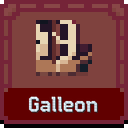</a> 
        <a href="assets/buildings/galleon/"><strong>Galleon</strong></a>
      </td>
      <td align="center" width="16.66%">
        <a href="assets/buildings/guard-tower/">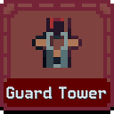</a> 
        <a href="assets/buildings/guard-tower/"><strong>Guard Tower</strong></a>
      </td>
      <td align="center" width="16.66%">
        <a href="assets/buildings/jousting-arena/">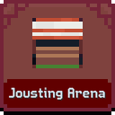</a> 
        <a href="assets/buildings/jousting-arena/"><strong>Jousting Arena</strong></a>
      </td>
    </tr>
    <tr>
      <td align="center" width="16.66%">
        <a href="assets/buildings/sparring-yard/">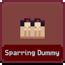</a> 
        <a href="assets/buildings/sparring-yard/"><strong>Sparring Dummy</strong></a>
      </td>
      <td align="center" width="16.66%">
        <a href="assets/buildings/stable/">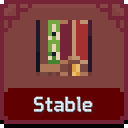</a> 
        <a href="assets/buildings/stable/"><strong>Stable</strong></a>
      </td>
      <td align="center" width="16.66%">
        <a href="assets/buildings/training-ring/">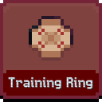</a> 
        <a href="assets/buildings/training-ring/"><strong>Training Ring</strong></a>
      </td>
    </tr>
  </tbody>
</table>

### Commercial

<table>
  <tbody>
    <tr>
      <td align="center" width="16.66%">
        <a href="assets/buildings/apothecary/">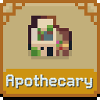</a> 
        <a href="assets/buildings/apothecary/"><strong>Apothecary</strong></a>
      </td>
      <td align="center" width="16.66%">
         
        <a href="assets/buildings/balloon/"><strong>Balloon Trader</strong></a>
      </td>
      <td align="center" width="16.66%">
         
        <a href="assets/buildings/bank/"><strong>Bank</strong></a>
      </td>
      <td align="center" width="16.66%">
         
        <a href="assets/buildings/botany-stall/"><strong>Botanist&#x27;s Stall</strong></a>
      </td>
      <td align="center" width="16.66%">
         
        <a href="assets/buildings/brewery/"><strong>Brewery</strong></a>
      </td>
      <td align="center" width="16.66%">
         
        <a href="assets/buildings/circus/"><strong>Circus</strong></a>
      </td>
    </tr>
    <tr>
      <td align="center" width="16.66%">
         
        <a href="assets/buildings/cotton-field/"><strong>Cotton Field</strong></a>
      </td>
      <td align="center" width="16.66%">
         
        <a href="assets/buildings/cotton-field-empty/"><strong>Cotton Field</strong></a>
      </td>
      <td align="center" width="16.66%">
         
        <a href="assets/buildings/deli-stall/"><strong>Deli Stall</strong></a>
      </td>
      <td align="center" width="16.66%">
         
        <a href="assets/buildings/gold-pan/"><strong>Gold Pan</strong></a>
      </td>
      <td align="center" width="16.66%">
         
        <a href="assets/buildings/grocer-stall/"><strong>Grocer&#x27;s Stall</strong></a>
      </td>
      <td align="center" width="16.66%">
         
        <a href="assets/buildings/jeweller/"><strong>Jeweller</strong></a>
      </td>
    </tr>
    <tr>
      <td align="center" width="16.66%">
         
        <a href="assets/buildings/lodging-house/"><strong>Lodging House</strong></a>
      </td>
      <td align="center" width="16.66%">
         
        <a href="assets/buildings/marketplace/"><strong>Marketplace</strong></a>
      </td>
      <td align="center" width="16.66%">
         
        <a href="assets/buildings/reliquary/"><strong>Reliquary</strong></a>
      </td>
      <td align="center" width="16.66%">
         
        <a href="assets/buildings/supplies-stall/"><strong>Supplies Stall</strong></a>
      </td>
      <td align="center" width="16.66%">
         
        <a href="assets/buildings/vault/"><strong>Vault</strong></a>
      </td>
      <td align="center" width="16.66%">
         
        <a href="assets/buildings/vineyard/"><strong>Vineyard</strong></a>
      </td>
    </tr>
    <tr>
      <td align="center" width="16.66%">
         
        <a href="assets/buildings/vineyard-empty/"><strong>Vineyard</strong></a>
      </td>
    </tr>
  </tbody>
</table>

### Civic

<table>
  <tbody>
    <tr>
      <td align="center" width="16.66%">
         
        <a href="assets/buildings/church/"><strong>Church</strong></a>
      </td>
      <td align="center" width="16.66%">
         
        <a href="assets/buildings/house-residence/"><strong>Estate</strong></a>
      </td>
      <td align="center" width="16.66%">
         
        <a href="assets/buildings/fountain/"><strong>Fountain</strong></a>
      </td>
      <td align="center" width="16.66%">
         
        <a href="assets/buildings/graveyard/"><strong>Graveyard</strong></a>
      </td>
      <td align="center" width="16.66%">
         
        <a href="assets/buildings/house-homestead/"><strong>Homestead</strong></a>
      </td>
      <td align="center" width="16.66%">
         
        <a href="assets/buildings/house-hut/"><strong>Hut</strong></a>
      </td>
    </tr>
    <tr>
      <td align="center" width="16.66%">
         
        <a href="assets/buildings/inn/"><strong>Inn</strong></a>
      </td>
      <td align="center" width="16.66%">
         
        <a href="assets/buildings/kitchen/"><strong>Kitchen</strong></a>
      </td>
      <td align="center" width="16.66%">
         
        <a href="assets/buildings/mason/"><strong>Mason</strong></a>
      </td>
      <td align="center" width="16.66%">
         
        <a href="assets/buildings/obelisk/"><strong>Obelisk</strong></a>
      </td>
      <td align="center" width="16.66%">
         
        <a href="assets/buildings/park/"><strong>Park</strong></a>
      </td>
      <td align="center" width="16.66%">
         
        <a href="assets/buildings/house-plot/"><strong>Plot</strong></a>
      </td>
    </tr>
    <tr>
      <td align="center" width="16.66%">
         
        <a href="assets/buildings/statue/"><strong>Statue</strong></a>
      </td>
      <td align="center" width="16.66%">
         
        <a href="assets/buildings/tax-collector/"><strong>Tax Collector</strong></a>
      </td>
      <td align="center" width="16.66%">
         
        <a href="assets/buildings/temple-east-wing/"><strong>Temple North-East Wing</strong></a>
      </td>
      <td align="center" width="16.66%">
         
        <a href="assets/buildings/temple-north-wing/"><strong>Temple North-West Wing</strong></a>
      </td>
      <td align="center" width="16.66%">
         
        <a href="assets/buildings/temple-south-wing/"><strong>Temple South-East Wing</strong></a>
      </td>
      <td align="center" width="16.66%">
         
        <a href="assets/buildings/temple-west-wing/"><strong>Temple South-West Wing</strong></a>
      </td>
    </tr>
    <tr>
      <td align="center" width="16.66%">
         
        <a href="assets/buildings/house-tenement/"><strong>Tenement</strong></a>
      </td>
      <td align="center" width="16.66%">
         
        <a href="assets/buildings/town-hall/"><strong>Town Hall</strong></a>
      </td>
      <td align="center" width="16.66%">
         
        <a href="assets/buildings/house-townhouse/"><strong>Townhouse</strong></a>
      </td>
      <td align="center" width="16.66%">
         
        <a href="assets/buildings/treasury/"><strong>Treasury</strong></a>
      </td>
    </tr>
  </tbody>
</table>

### Arcane

<table>
  <tbody>
    <tr>
      <td align="center" width="16.66%">
         
        <a href="assets/buildings/enclave/"><strong>Enclave</strong></a>
      </td>
      <td align="center" width="16.66%">
         
        <a href="assets/buildings/faerie-ring/"><strong>Faerie Ring</strong></a>
      </td>
      <td align="center" width="16.66%">
         
        <a href="assets/buildings/nomad-wagon/"><strong>Nomad&#x27;s Wagon</strong></a>
      </td>
      <td align="center" width="16.66%">
         
        <a href="assets/buildings/magic-portal/"><strong>Portal</strong></a>
      </td>
      <td align="center" width="16.66%">
         
        <a href="assets/buildings/wizards-tower/"><strong>Wizard&#x27;s Tower</strong></a>
      </td>
    </tr>
  </tbody>
</table>

### Marine

<table>
  <tbody>
    <tr>
      <td align="center" width="16.66%">
         
        <a href="assets/buildings/canal/"><strong>Canal</strong></a>
      </td>
      <td align="center" width="16.66%">
         
        <a href="assets/buildings/clipper/"><strong>Clipper</strong></a>
      </td>
      <td align="center" width="16.66%">
         
        <a href="assets/buildings/crane/"><strong>Crane</strong></a>
      </td>
      <td align="center" width="16.66%">
         
        <a href="assets/buildings/fish-farm/"><strong>Fish Farm</strong></a>
      </td>
      <td align="center" width="16.66%">
         
        <a href="assets/buildings/fish-trap/"><strong>Fish Trap</strong></a>
      </td>
      <td align="center" width="16.66%">
         
        <a href="assets/buildings/fishing-boat/"><strong>Fishing Boat</strong></a>
      </td>
    </tr>
    <tr>
      <td align="center" width="16.66%">
         
        <a href="assets/buildings/fisher/"><strong>Fishing Hut</strong></a>
      </td>
      <td align="center" width="16.66%">
         
        <a href="assets/buildings/kelp-field/"><strong>Kelp Field</strong></a>
      </td>
      <td align="center" width="16.66%">
         
        <a href="assets/buildings/lighthouse/"><strong>Lighthouse</strong></a>
      </td>
      <td align="center" width="16.66%">
         
        <a href="assets/buildings/ocean-temple/"><strong>Ocean Shrine</strong></a>
      </td>
      <td align="center" width="16.66%">
         
        <a href="assets/buildings/port/"><strong>Port</strong></a>
      </td>
      <td align="center" width="16.66%">
         
        <a href="assets/buildings/quay/"><strong>Quay</strong></a>
      </td>
    </tr>
    <tr>
      <td align="center" width="16.66%">
         
        <a href="assets/buildings/seaweed-farm/"><strong>Seaweed Farm</strong></a>
      </td>
      <td align="center" width="16.66%">
         
        <a href="assets/buildings/trading-post/"><strong>Trading Post</strong></a>
      </td>
      <td align="center" width="16.66%">
         
        <a href="assets/buildings/trawler/"><strong>Trawler</strong></a>
      </td>
      <td align="center" width="16.66%">
         
        <a href="assets/buildings/warehouse/"><strong>Warehouse</strong></a>
      </td>
    </tr>
  </tbody>
</table>

### Frontier

<table>
  <tbody>
    <tr>
      <td align="center" width="16.66%">
         
        <a href="assets/buildings/campfire-depleted/"><strong>Ash</strong></a>
      </td>
      <td align="center" width="16.66%">
         
        <a href="assets/buildings/campfire/"><strong>Campfire</strong></a>
      </td>
      <td align="center" width="16.66%">
         
        <a href="assets/buildings/forester/"><strong>Forester</strong></a>
      </td>
      <td align="center" width="16.66%">
         
        <a href="assets/buildings/grove/"><strong>Grove</strong></a>
      </td>
      <td align="center" width="16.66%">
         
        <a href="assets/buildings/herb-garden/"><strong>Herb Garden</strong></a>
      </td>
      <td align="center" width="16.66%">
         
        <a href="assets/buildings/herbalist/"><strong>Herbalist</strong></a>
      </td>
    </tr>
    <tr>
      <td align="center" width="16.66%">
         
        <a href="assets/buildings/hunting-lodge/"><strong>Hunting Lodge</strong></a>
      </td>
      <td align="center" width="16.66%">
         
        <a href="assets/buildings/palisade/"><strong>Palisade</strong></a>
      </td>
      <td align="center" width="16.66%">
         
        <a href="assets/buildings/shaman/"><strong>Shaman</strong></a>
      </td>
      <td align="center" width="16.66%">
         
        <a href="assets/buildings/shrine/"><strong>Shrine</strong></a>
      </td>
      <td align="center" width="16.66%">
         
        <a href="assets/buildings/lantern/"><strong>Stone Lantern</strong></a>
      </td>
      <td align="center" width="16.66%">
         
        <a href="assets/buildings/tannery/"><strong>Tannery</strong></a>
      </td>
    </tr>
    <tr>
      <td align="center" width="16.66%">
         
        <a href="assets/buildings/trapper/"><strong>Trapper&#x27;s Lodge</strong></a>
      </td>
      <td align="center" width="16.66%">
         
        <a href="assets/buildings/watch-tower/"><strong>Watch Tower</strong></a>
      </td>
      <td align="center" width="16.66%">
         
        <a href="assets/buildings/witch-hut/"><strong>Witch&#x27;s Hut</strong></a>
      </td>
      <td align="center" width="16.66%">
         
        <a href="assets/buildings/woodcutter/"><strong>Woodcutter</strong></a>
      </td>
    </tr>
  </tbody>
</table>

### Rogues

<table>
  <tbody>
    <tr>
      <td align="center" width="16.66%">
         
        <a href="assets/buildings/bandit-camp/"><strong>Bandit Camp</strong></a>
      </td>
      <td align="center" width="16.66%">
         
        <a href="assets/buildings/hideout/"><strong>Hideout</strong></a>
      </td>
      <td align="center" width="16.66%">
         
        <a href="assets/buildings/pirate-ship/"><strong>Pirate Ship</strong></a>
      </td>
      <td align="center" width="16.66%">
         
        <a href="assets/buildings/treasure-chest/"><strong>Treasure Chest</strong></a>
      </td>
    </tr>
  </tbody>
</table>

### Neutral / No guild

<table>
  <tbody>
    <tr>
      <td align="center" width="16.66%">
         
        <a href="assets/buildings/berry-bush/"><strong>Berry Bush</strong></a>
      </td>
      <td align="center" width="16.66%">
         
        <a href="assets/buildings/conduit/"><strong>Conduit</strong></a>
      </td>
      <td align="center" width="16.66%">
         
        <a href="assets/buildings/berry-bush-empty/"><strong>Empty Bush</strong></a>
      </td>
      <td align="center" width="16.66%">
         
        <a href="assets/buildings/fish/"><strong>Fish</strong></a>
      </td>
      <td align="center" width="16.66%">
         
        <a href="assets/buildings/flowers/"><strong>Flowers</strong></a>
      </td>
      <td align="center" width="16.66%">
         
        <a href="assets/buildings/trees/"><strong>Forest</strong></a>
      </td>
    </tr>
    <tr>
      <td align="center" width="16.66%">
         
        <a href="assets/buildings/gold-ore/"><strong>Gold Ore</strong></a>
      </td>
      <td align="center" width="16.66%">
         
        <a href="assets/buildings/herbs/"><strong>Herbs</strong></a>
      </td>
      <td align="center" width="16.66%">
         
        <a href="assets/buildings/lamppost/"><strong>Lamppost</strong></a>
      </td>
      <td align="center" width="16.66%">
         
        <a href="assets/buildings/lumber/"><strong>Lumber</strong></a>
      </td>
      <td align="center" width="16.66%">
         
        <a href="assets/buildings/magic-ruin/"><strong>Magical Ruin</strong></a>
      </td>
      <td align="center" width="16.66%">
         
        <a href="assets/buildings/ore/"><strong>Ore</strong></a>
      </td>
    </tr>
    <tr>
      <td align="center" width="16.66%">
         
        <a href="assets/buildings/plateau/"><strong>Plateau</strong></a>
      </td>
      <td align="center" width="16.66%">
         
        <a href="assets/buildings/plaza/"><strong>Plaza</strong></a>
      </td>
      <td align="center" width="16.66%">
         
        <a href="assets/buildings/post-office/"><strong>Post Office</strong></a>
      </td>
      <td align="center" width="16.66%">
         
        <a href="assets/buildings/rail/"><strong>Railway</strong></a>
      </td>
      <td align="center" width="16.66%">
         
        <a href="assets/buildings/rocks/"><strong>Rocks</strong></a>
      </td>
      <td align="center" width="16.66%">
         
        <a href="assets/buildings/ruin/"><strong>Ruin</strong></a>
      </td>
    </tr>
    <tr>
      <td align="center" width="16.66%">
         
        <a href="assets/buildings/scaffolding/"><strong>Scaffolding</strong></a>
      </td>
      <td align="center" width="16.66%">
         
        <a href="assets/buildings/sewer/"><strong>Sewer</strong></a>
      </td>
      <td align="center" width="16.66%">
         
        <a href="assets/buildings/town-bell/"><strong>Town Bell</strong></a>
      </td>
      <td align="center" width="16.66%">
         
        <a href="assets/buildings/wall/"><strong>Wall</strong></a>
      </td>
      <td align="center" width="16.66%">
         
        <a href="assets/buildings/way-station/"><strong>Way Station</strong></a>
      </td>
      <td align="center" width="16.66%">
         
        <a href="assets/buildings/well/"><strong>Well</strong></a>
      </td>
    </tr>
  </tbody>
</table>

### Hazards (not a guild)

<table>
  <tbody>
    <tr>
      <td align="center" width="16.66%">
         
        <a href="assets/buildings/corrupted-fort/"><strong>Corrupted Fort</strong></a>
      </td>
      <td align="center" width="16.66%">
         
        <a href="assets/buildings/corrupted-grove/"><strong>Corrupted Grove</strong></a>
      </td>
      <td align="center" width="16.66%">
         
        <a href="assets/buildings/corrupted-lantern/"><strong>Corrupted Lantern</strong></a>
      </td>
      <td align="center" width="16.66%">
         
        <a href="assets/buildings/corrupted-mine/"><strong>Corrupted Mine</strong></a>
      </td>
      <td align="center" width="16.66%">
         
        <a href="assets/buildings/corrupted-obelisk/"><strong>Corrupted Obelisk</strong></a>
      </td>
      <td align="center" width="16.66%">
         
        <a href="assets/buildings/corrupted-shrine/"><strong>Corrupted Shrine</strong></a>
      </td>
    </tr>
    <tr>
      <td align="center" width="16.66%">
         
        <a href="assets/buildings/corrupted-temple/"><strong>Corrupted Temple</strong></a>
      </td>
      <td align="center" width="16.66%">
         
        <a href="assets/buildings/corrupted-tower/"><strong>Corrupted Tower</strong></a>
      </td>
    </tr>
  </tbody>
</table>
