# Balloon Trader

Passively: other buildings in range are considered Luxury

## Basic information

| Field | Value |
| --- | --- |
| Catalog ID | `balloon` |
| Game tag | `Balloon` (243) |
| Categories | Commercial, Trader |
| Rarity | Rare |
| Draft group | Default |
| Can be placed on | Grass, Sand |
| Placement count | 1 |
| Range | 4 |
| Can activate | No |

## Visual references

### Card preview

### Information card

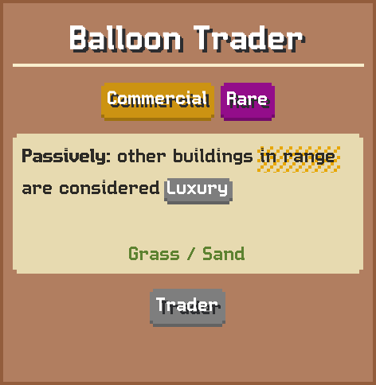

### Animated building on grass

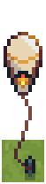

[Catalog icon](icon.png) · [Transparent world sprite](ground.png)

## Related catalog entries

- Targets Category: **Luxury**
- Affected By Mechanic: Adjacency And Range
- Affected By Mechanic: Building Draft Rarity Weights
- Affected By Mechanic: Rarity Milestone Multipliers
- Affected By Mechanic: Building Draft Roll Weight
- Affected By Mechanic: Trigger Execution Priority

## Additional reference assets

Animation frames (6)

- [animation-frame-000.png](animation-frame-000.png) — Index: 0; Duration: 0.4
- [animation-frame-001.png](animation-frame-001.png) — Index: 1; Duration: 0.4
- [animation-frame-002.png](animation-frame-002.png) — Index: 2; Duration: 0.4
- [animation-frame-003.png](animation-frame-003.png) — Index: 3; Duration: 0.4
- [animation-frame-004.png](animation-frame-004.png) — Index: 4; Duration: 0.4
- [animation-frame-005.png](animation-frame-005.png) — Index: 5; Duration: 0.4

Terrain context renders (2)

<table>
<tr>
<td align="center" valign="bottom">
<a href="context-grass.png">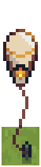</a> 
Grass
</td>
<td align="center" valign="bottom">
<a href="context-sand.png">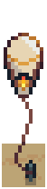</a> 
Sand
</td>
</tr>
</table>

Painted world sprites (7)

<strong>Base sprite</strong>

<table>
<tr>
<td align="center" valign="bottom">
<a href="ground-paint-blue.png">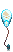</a> 
Blue
</td>
<td align="center" valign="bottom">
<a href="ground-paint-dark.png">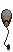</a> 
Dark
</td>
<td align="center" valign="bottom">
<a href="ground-paint-gold.png">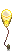</a> 
Gold
</td>
<td align="center" valign="bottom">
<a href="ground-paint-green.png">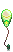</a> 
Green
</td>
<td align="center" valign="bottom">
<a href="ground-paint-purple.png">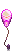</a> 
Purple
</td>
<td align="center" valign="bottom">
<a href="ground-paint-red.png">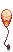</a> 
Red
</td>
<td align="center" valign="bottom">
<a href="ground-paint-white.png">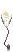</a> 
White
</td>
</tr>
</table>

## Structured source

- [Normalized building record](../../../data/entities/buildings/balloon.json)

This page is generated from the normalized catalog record. Runtime-dependent values may vary during a game.
