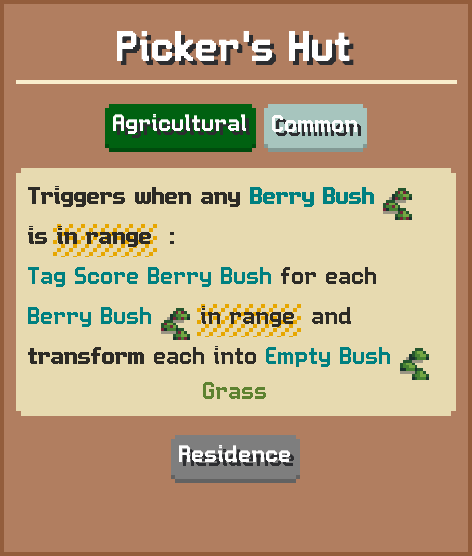
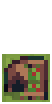
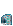
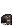
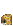
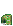
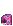
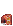
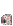

# Picker's Hut

Triggers when any Berry Bush is in range:  
Tag Score Berry Bush for each Berry Bush in range and transform each into Empty Bush

## Basic information

| Field | Value |
| --- | --- |
| Catalog ID | `berry-picker` |
| Game tag | `BerryPicker` (112) |
| Categories | Agricultural, Residence |
| Rarity | Common |
| Draft group | Starter |
| Can be placed on | Grass |
| Placement count | 1 |
| Range | 2 |
| Can activate | Yes |

## Visual references

### Card preview

### Information card

[Catalog icon](icon.png) · [Transparent world sprite](ground.png)

## Related catalog entries

- Targets Entity: [Berry Bush](../berry-bush/)
- Targets Entity: [Empty Bush](../berry-bush-empty/)
- Transforms Into: [Empty Bush](../berry-bush-empty/)
- Affected By Mechanic: Harvesting
- Affected By Mechanic: Adjacency And Range
- Affected By Mechanic: Building Draft Rarity Weights
- Affected By Mechanic: Rarity Milestone Multipliers
- Affected By Mechanic: Building Draft Roll Weight
- Affected By Mechanic: Trigger Execution Priority

## Additional reference assets

Terrain context renders (1)

<table>
<tr>
<td align="center" valign="bottom">
 
Grass
</td>
</tr>
</table>

Painted world sprites (7)

<strong>Base sprite</strong>

<table>
<tr>
<td align="center" valign="bottom">
 
Blue
</td>
<td align="center" valign="bottom">
 
Dark
</td>
<td align="center" valign="bottom">
 
Gold
</td>
<td align="center" valign="bottom">
 
Green
</td>
<td align="center" valign="bottom">
 
Purple
</td>
<td align="center" valign="bottom">
 
Red
</td>
<td align="center" valign="bottom">
 
White
</td>
</tr>
</table>

## Structured source

- [Normalized building record](../../../data/entities/buildings/berry-picker.json)

This page is generated from the normalized catalog record. Runtime-dependent values may vary during a game.
