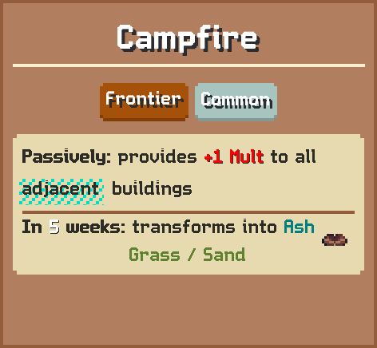

# Campfire

Passively: provides 1 Mult to all adjacent buildings  
In 5 weeks: transforms into Ash

## Basic information

| Field | Value |
| --- | --- |
| Catalog ID | `campfire` |
| Game tag | `Campfire` (132) |
| Categories | Frontier |
| Rarity | Common |
| Draft group | Secondary |
| Can be placed on | Grass, Sand |
| Placement count | 1 |
| Cooldown | 5 weeks |
| Multiplier | 1 |
| Can activate | No |

## Visual references

### Card preview

### Information card

### Animated building on grass

[Catalog icon](icon.png) · [Transparent world sprite](ground.png)

## Related catalog entries

- Transforms Into: [Ash](../campfire-depleted/)
- Affected By Mechanic: Building Draft Rarity Weights
- Affected By Mechanic: Rarity Milestone Multipliers
- Affected By Mechanic: Building Draft Roll Weight
- Affected By Mechanic: Trigger Execution Priority

## Additional reference assets

Animation frames (8)

- [animation-frame-000.png](animation-frame-000.png) — Index: 0; Duration: 0.08
- [animation-frame-001.png](animation-frame-001.png) — Index: 1; Duration: 0.08
- [animation-frame-002.png](animation-frame-002.png) — Index: 2; Duration: 0.08
- [animation-frame-003.png](animation-frame-003.png) — Index: 3; Duration: 0.08
- [animation-frame-004.png](animation-frame-004.png) — Index: 4; Duration: 0.08
- [animation-frame-005.png](animation-frame-005.png) — Index: 5; Duration: 0.08
- [animation-frame-006.png](animation-frame-006.png) — Index: 6; Duration: 0.08
- [animation-frame-007.png](animation-frame-007.png) — Index: 7; Duration: 0.08

Terrain context renders (2)

<table>
<tr>
<td align="center" valign="bottom">
 
Grass
</td>
<td align="center" valign="bottom">
 
Sand
</td>
</tr>
</table>

Painted world sprites (1)

<strong>Base sprite</strong>

<table>
<tr>
<td align="center" valign="bottom">
 
Dark
</td>
</tr>
</table>

## Structured source

- [Normalized building record](../../../data/entities/buildings/campfire.json)

This page is generated from the normalized catalog record. Runtime-dependent values may vary during a game.
