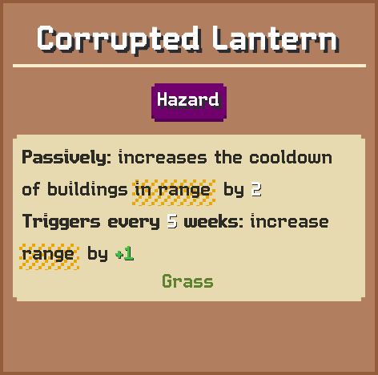

# Corrupted Lantern

Passively: increases the cooldown of buildings in range by +2  
Triggers every 5 weeks: increase in range by +1

## Basic information

| Field | Value |
| --- | --- |
| Catalog ID | `corrupted-lantern` |
| Game tag | `CorruptedLantern` (401) |
| Categories | Hazard |
| Draft group | Default |
| Can be placed on | Grass |
| Placement count | 1 |
| Cooldown | 5 weeks |
| Range | 2 |
| Can activate | No |

## Visual references

### Card preview

### Information card

[Catalog icon](icon.png) · [Transparent world sprite](ground.png)

## Related catalog entries

- Affected By Mechanic: Adjacency And Range
- Affected By Mechanic: Trigger Execution Priority

## Additional reference assets

Terrain context renders (1)

<table>
<tr>
<td align="center" valign="bottom">
 
Grass
</td>
</tr>
</table>

## Structured source

- [Normalized building record](../../../data/entities/buildings/corrupted-lantern.json)

This page is generated from the normalized catalog record. Runtime-dependent values may vary during a game.
