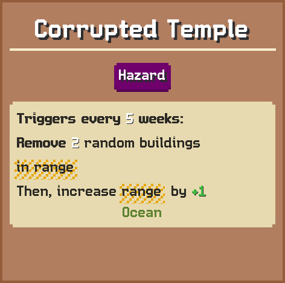

# Corrupted Temple

Triggers every 5 weeks:  
Remove 2 random buildings in range  
Then, increase in range by +1

## Basic information

| Field | Value |
| --- | --- |
| Catalog ID | `corrupted-temple` |
| Game tag | `CorruptedTemple` (407) |
| Categories | Hazard |
| Draft group | Default |
| Can be placed on | Ocean |
| Placement count | 1 |
| Cooldown | 5 weeks |
| Range | 2 |
| Can activate | No |

## Visual references

### Card preview

### Information card

[Catalog icon](icon.png) · [Transparent world sprite](ground.png)

## Related catalog entries

- Affected By Mechanic: Adjacency And Range
- Affected By Mechanic: Trigger Execution Priority
## Structured source

- [Normalized building record](../../../data/entities/buildings/corrupted-temple.json)

This page is generated from the normalized catalog record. Runtime-dependent values may vary during a game.
