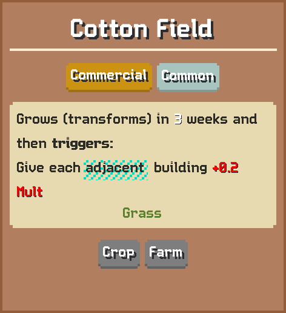
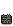
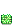

# Cotton Field

Grows (transforms) in 3 weeks and then triggers:  
Give each adjacent building 0.2 Mult

## Basic information

| Field | Value |
| --- | --- |
| Catalog ID | `cotton-field` |
| Game tag | `CottonField` (254) |
| Categories | Commercial, Crop, Farm |
| Rarity | Common |
| Draft group | Default |
| Can be placed on | Grass |
| Placement count | 1 |
| Cooldown | 3 weeks |
| Irrigated cooldown | 1 week |
| Multiplier | 0.2 |
| Can activate | Yes |

## Visual references

### Card preview

### Information card

[Catalog icon](icon.png) · [Transparent world sprite](ground.png)

## Related catalog entries

- Affected By Category: **Irrigator**
- Affected By Mechanic: Crop Growth
- Affected By Mechanic: Building Draft Rarity Weights
- Affected By Mechanic: Rarity Milestone Multipliers
- Affected By Mechanic: Building Draft Roll Weight
- Affected By Mechanic: Trigger Execution Priority
- Alternate Placed Type: [Cotton Field](../cotton-field-empty/)

## Additional reference assets

Terrain context renders (1)

<table>
<tr>
<td align="center" valign="bottom">
 
Grass
</td>
</tr>
</table>

Painted world sprites (7)

<strong>Base sprite</strong>

<table>
<tr>
<td align="center" valign="bottom">
 
Blue
</td>
<td align="center" valign="bottom">
 
Dark
</td>
<td align="center" valign="bottom">
 
Gold
</td>
<td align="center" valign="bottom">
 
Green
</td>
<td align="center" valign="bottom">
 
Purple
</td>
<td align="center" valign="bottom">
 
Red
</td>
<td align="center" valign="bottom">
 
White
</td>
</tr>
</table>

## Structured source

- [Normalized building record](../../../data/entities/buildings/cotton-field.json)

This page is generated from the normalized catalog record. Runtime-dependent values may vary during a game.
