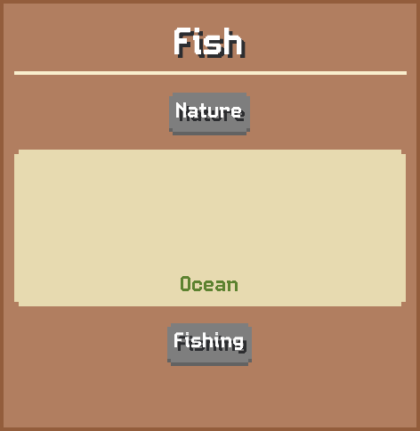

# Fish

No description is available.

## Basic information

| Field | Value |
| --- | --- |
| Catalog ID | `fish` |
| Game tag | `Fish` (6) |
| Categories | None, Nature, Fishing |
| Draft group | Default |
| Can be placed on | Ocean |
| Placement count | 1 |
| Can activate | No |

## Visual references

### Card preview

### Information card

[Catalog icon](icon.png) · [Transparent world sprite](ground.png)

## Related catalog entries

- Affected By Mechanic: Trigger Execution Priority

## Additional reference assets

Painted world sprites (1)

<strong>Base sprite</strong>

<table>
<tr>
<td align="center" valign="bottom">
 
Dark
</td>
</tr>
</table>

## Structured source

- [Normalized building record](../../../data/entities/buildings/fish.json)

This page is generated from the normalized catalog record. Runtime-dependent values may vary during a game.
