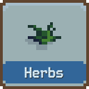
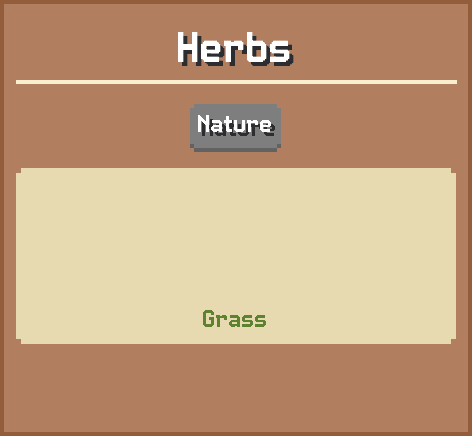
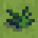

# Herbs

No description is available.

## Basic information

| Field | Value |
| --- | --- |
| Catalog ID | `herbs` |
| Game tag | `Herbs` (3) |
| Categories | None, Nature |
| Draft group | Default |
| Can be placed on | Grass |
| Placement count | 1 |
| Can activate | No |

## Visual references

### Card preview

### Information card

[Catalog icon](icon.png) · [Transparent world sprite](ground.png)

## Related catalog entries

- Affected By Mechanic: Trigger Execution Priority

## Additional reference assets

Terrain context renders (1)

<table>
<tr>
<td align="center" valign="bottom">
 
Grass
</td>
</tr>
</table>

World sprite variants (4)

- [ground-variant-000.png](ground-variant-000.png) — Index: 0
- [ground-variant-001.png](ground-variant-001.png) — Index: 1
- [ground-variant-002.png](ground-variant-002.png) — Index: 2
- [ground-variant-003.png](ground-variant-003.png) — Index: 3

Painted world sprites (5)

<strong>Base sprite</strong>

<table>
<tr>
<td align="center" valign="bottom">
 
Dark
</td>
</tr>
</table>

<strong>Variant 1</strong>

<table>
<tr>
<td align="center" valign="bottom">
 
Dark
</td>
</tr>
</table>

<strong>Variant 2</strong>

<table>
<tr>
<td align="center" valign="bottom">
 
Dark
</td>
</tr>
</table>

<strong>Variant 3</strong>

<table>
<tr>
<td align="center" valign="bottom">
 
Dark
</td>
</tr>
</table>

<strong>Variant 4</strong>

<table>
<tr>
<td align="center" valign="bottom">
 
Dark
</td>
</tr>
</table>

## Structured source

- [Normalized building record](../../../data/entities/buildings/herbs.json)

This page is generated from the normalized catalog record. Runtime-dependent values may vary during a game.
