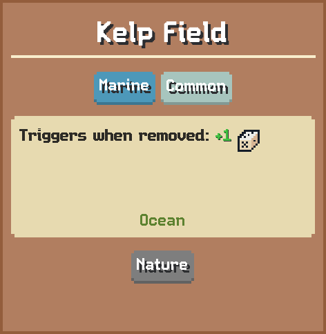

# Kelp Field

Triggers when removed: 1

## Basic information

| Field | Value |
| --- | --- |
| Catalog ID | `kelp-field` |
| Game tag | `KelpField` (154) |
| Categories | Marine, Nature |
| Rarity | Common |
| Draft group | Default |
| Can be placed on | Ocean |
| Placement count | 3 |
| Can activate | Yes |

## Visual references

### Card preview

### Information card

[Catalog icon](icon.png) · [Transparent world sprite](ground.png)

## Related catalog entries

- Affected By Mechanic: Building Draft Rarity Weights
- Affected By Mechanic: Rarity Milestone Multipliers
- Affected By Mechanic: Building Draft Roll Weight
- Affected By Mechanic: Trigger Execution Priority

## Additional reference assets

Painted world sprites (1)

<strong>Base sprite</strong>

<table>
<tr>
<td align="center" valign="bottom">
 
Dark
</td>
</tr>
</table>

## Structured source

- [Normalized building record](../../../data/entities/buildings/kelp-field.json)

This page is generated from the normalized catalog record. Runtime-dependent values may vary during a game.
