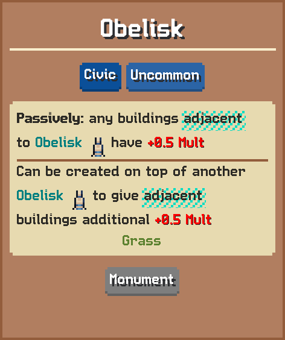

# Obelisk

Passively: any buildings adjacent to Obelisk have 0.5 Mult  
Can be created on top of another Obelisk to give adjacent buildings additional 0.5 Mult

## Basic information

| Field | Value |
| --- | --- |
| Catalog ID | `obelisk` |
| Game tag | `Obelisk` (265) |
| Categories | Civic, Monument |
| Rarity | Uncommon |
| Draft group | Default |
| Can be placed on | Grass |
| Placement count | 1 |
| Multiplier | 0.5 |
| Can activate | No |

## Visual references

### Card preview

### Information card

[Catalog icon](icon.png) · [Transparent world sprite](ground.png)

## Related catalog entries

- Affected By Mechanic: Building Draft Rarity Weights
- Affected By Mechanic: Rarity Milestone Multipliers
- Affected By Mechanic: Building Draft Roll Weight
- Affected By Mechanic: Trigger Execution Priority

## Additional reference assets

Animation frames (5)

- [animation-frame-000.png](animation-frame-000.png) — Index: 0; Duration: 0
- [animation-frame-001.png](animation-frame-001.png) — Index: 1; Duration: 0
- [animation-frame-002.png](animation-frame-002.png) — Index: 2; Duration: 0
- [animation-frame-003.png](animation-frame-003.png) — Index: 3; Duration: 0
- [animation-frame-004.png](animation-frame-004.png) — Index: 4; Duration: 0

Terrain context renders (1)

<table>
<tr>
<td align="center" valign="bottom">
 
Grass
</td>
</tr>
</table>

Painted world sprites (1)

<strong>Base sprite</strong>

<table>
<tr>
<td align="center" valign="bottom">
 
Dark
</td>
</tr>
</table>

## Structured source

- [Normalized building record](../../../data/entities/buildings/obelisk.json)

This page is generated from the normalized catalog record. Runtime-dependent values may vary during a game.
