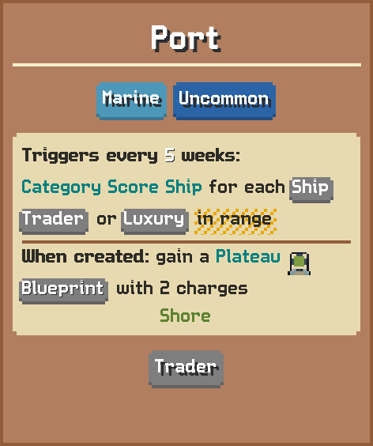

# Port

Triggers every 5 weeks:  
Category Score Ship for each Ship Trader or Luxury in range  
When created: gain a Plateau Blueprint with 2 charges

## Basic information

| Field | Value |
| --- | --- |
| Catalog ID | `port` |
| Game tag | `Port` (156) |
| Categories | Marine, Trader |
| Rarity | Uncommon |
| Draft group | Default |
| Can be placed on | Shore |
| Placement count | 1 |
| Cooldown | 5 weeks |
| Range | 5 |
| Can activate | Yes |

## Visual references

### Card preview

### Information card

[Catalog icon](icon.png) · [Transparent world sprite](ground.png)

## Related catalog entries

- Targets Category: **Ship**
- Targets Category: **Trader**
- Targets Category: **Luxury**
- Affected By Mechanic: Adjacency And Range
- Affected By Mechanic: Building Draft Rarity Weights
- Affected By Mechanic: Rarity Milestone Multipliers
- Affected By Mechanic: Building Draft Roll Weight
- Affected By Mechanic: Trigger Execution Priority

## Additional reference assets

World sprite variants (1)

- [ground-variant-000.png](ground-variant-000.png) — Index: 0

Painted world sprites (14)

<strong>Base sprite</strong>

<table>
<tr>
<td align="center" valign="bottom">
 
Blue
</td>
<td align="center" valign="bottom">
 
Dark
</td>
<td align="center" valign="bottom">
 
Gold
</td>
<td align="center" valign="bottom">
 
Green
</td>
<td align="center" valign="bottom">
 
Purple
</td>
<td align="center" valign="bottom">
 
Red
</td>
<td align="center" valign="bottom">
 
White
</td>
</tr>
</table>

<strong>Variant 1</strong>

<table>
<tr>
<td align="center" valign="bottom">
 
Blue
</td>
<td align="center" valign="bottom">
 
Dark
</td>
<td align="center" valign="bottom">
 
Gold
</td>
<td align="center" valign="bottom">
 
Green
</td>
<td align="center" valign="bottom">
 
Purple
</td>
<td align="center" valign="bottom">
 
Red
</td>
<td align="center" valign="bottom">
 
White
</td>
</tr>
</table>

## Structured source

- [Normalized building record](../../../data/entities/buildings/port.json)

This page is generated from the normalized catalog record. Runtime-dependent values may vary during a game.
