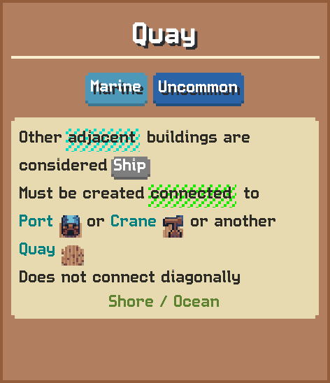
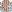
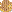
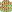

# Quay

Other adjacent buildings are considered Ship  
Must be created connected to Port or Crane or another Quay  
Does not connect diagonally

## Basic information

| Field | Value |
| --- | --- |
| Catalog ID | `quay` |
| Game tag | `Quay` (157) |
| Categories | Marine |
| Rarity | Uncommon |
| Draft group | Default |
| Can be placed on | Shore, Ocean |
| Placement count | 3 |
| Can activate | No |

## Visual references

### Card preview

### Information card

[Catalog icon](icon.png) · [Transparent world sprite](ground.png)

## Related catalog entries

- Targets Category: **Ship**
- Affected By Mechanic: Building Draft Rarity Weights
- Affected By Mechanic: Rarity Milestone Multipliers
- Affected By Mechanic: Building Draft Roll Weight
- Affected By Mechanic: Trigger Execution Priority

## Additional reference assets

Painted world sprites (7)

<strong>Base sprite</strong>

<table>
<tr>
<td align="center" valign="bottom">
 
Blue
</td>
<td align="center" valign="bottom">
 
Dark
</td>
<td align="center" valign="bottom">
 
Gold
</td>
<td align="center" valign="bottom">
 
Green
</td>
<td align="center" valign="bottom">
 
Purple
</td>
<td align="center" valign="bottom">
 
Red
</td>
<td align="center" valign="bottom">
 
White
</td>
</tr>
</table>

## Structured source

- [Normalized building record](../../../data/entities/buildings/quay.json)

This page is generated from the normalized catalog record. Runtime-dependent values may vary during a game.
