# Slums

Passively: every week, each connected Slums has a 30% chance to create another Slums on a random tile connected to the group

## Basic information

| Field | Value |
| --- | --- |
| Catalog ID | `shanty-town` |
| Game tag | `ShantyTown` (225) |
| Categories | Industrial, Residence |
| Rarity | Uncommon |
| Draft group | Default |
| Can be placed on | Grass |
| Placement count | 2 |
| Can activate | No |

## Visual references

### Card preview

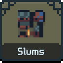

### Information card

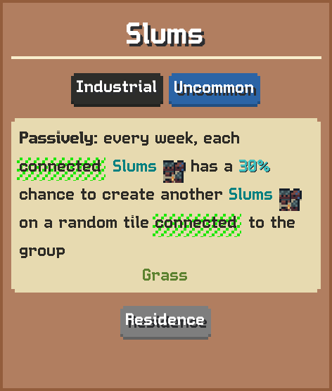

[Catalog icon](icon.png) · [Transparent world sprite](ground.png)

## Related catalog entries

- Affected By Mechanic: Building Draft Rarity Weights
- Affected By Mechanic: Rarity Milestone Multipliers
- Affected By Mechanic: Building Draft Roll Weight
- Affected By Mechanic: Trigger Execution Priority

## Additional reference assets

Terrain context renders (1)

<table>
<tr>
<td align="center" valign="bottom">
<a href="context-grass.png">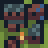</a> 
Grass
</td>
</tr>
</table>

World sprite variants (3)

- [ground-variant-000.png](ground-variant-000.png) — Index: 0
- [ground-variant-001.png](ground-variant-001.png) — Index: 1
- [ground-variant-002.png](ground-variant-002.png) — Index: 2

Painted world sprites (28)

<strong>Base sprite</strong>

<table>
<tr>
<td align="center" valign="bottom">
 
Blue
</td>
<td align="center" valign="bottom">
 
Dark
</td>
<td align="center" valign="bottom">
<a href="ground-paint-gold.png">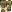</a> 
Gold
</td>
<td align="center" valign="bottom">
<a href="ground-paint-green.png">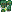</a> 
Green
</td>
<td align="center" valign="bottom">
<a href="ground-paint-purple.png">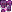</a> 
Purple
</td>
<td align="center" valign="bottom">
 
Red
</td>
<td align="center" valign="bottom">
<a href="ground-paint-white.png">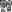</a> 
White
</td>
</tr>
</table>

<strong>Variant 1</strong>

<table>
<tr>
<td align="center" valign="bottom">
<a href="ground-variant-000-paint-blue.png">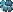</a> 
Blue
</td>
<td align="center" valign="bottom">
<a href="ground-variant-000-paint-dark.png">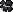</a> 
Dark
</td>
<td align="center" valign="bottom">
<a href="ground-variant-000-paint-gold.png">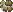</a> 
Gold
</td>
<td align="center" valign="bottom">
<a href="ground-variant-000-paint-green.png">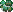</a> 
Green
</td>
<td align="center" valign="bottom">
<a href="ground-variant-000-paint-purple.png">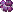</a> 
Purple
</td>
<td align="center" valign="bottom">
<a href="ground-variant-000-paint-red.png">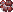</a> 
Red
</td>
<td align="center" valign="bottom">
<a href="ground-variant-000-paint-white.png">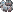</a> 
White
</td>
</tr>
</table>

<strong>Variant 2</strong>

<table>
<tr>
<td align="center" valign="bottom">
<a href="ground-variant-001-paint-blue.png">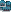</a> 
Blue
</td>
<td align="center" valign="bottom">
<a href="ground-variant-001-paint-dark.png">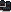</a> 
Dark
</td>
<td align="center" valign="bottom">
<a href="ground-variant-001-paint-gold.png">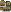</a> 
Gold
</td>
<td align="center" valign="bottom">
<a href="ground-variant-001-paint-green.png">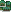</a> 
Green
</td>
<td align="center" valign="bottom">
<a href="ground-variant-001-paint-purple.png">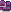</a> 
Purple
</td>
<td align="center" valign="bottom">
<a href="ground-variant-001-paint-red.png">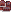</a> 
Red
</td>
<td align="center" valign="bottom">
<a href="ground-variant-001-paint-white.png">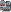</a> 
White
</td>
</tr>
</table>

<strong>Variant 3</strong>

<table>
<tr>
<td align="center" valign="bottom">
<a href="ground-variant-002-paint-blue.png">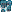</a> 
Blue
</td>
<td align="center" valign="bottom">
<a href="ground-variant-002-paint-dark.png">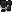</a> 
Dark
</td>
<td align="center" valign="bottom">
 
Gold
</td>
<td align="center" valign="bottom">
 
Green
</td>
<td align="center" valign="bottom">
 
Purple
</td>
<td align="center" valign="bottom">
<a href="ground-variant-002-paint-red.png">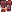</a> 
Red
</td>
<td align="center" valign="bottom">
 
White
</td>
</tr>
</table>

## Structured source

- [Normalized building record](../../../data/entities/buildings/shanty-town.json)

This page is generated from the normalized catalog record. Runtime-dependent values may vary during a game.
