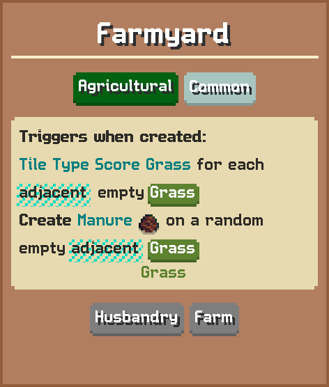
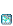
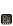
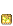
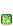
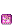
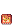
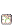

# Farmyard

Triggers when created:  
Tile Type Score Grass for each adjacent empty Grass  
Create Manure on a random empty adjacent Grass

## Basic information

| Field | Value |
| --- | --- |
| Catalog ID | `sheep-farm` |
| Game tag | `SheepFarm` (107) |
| Categories | Agricultural, Husbandry, Farm |
| Rarity | Common |
| Draft group | Secondary |
| Can be placed on | Grass |
| Placement count | 1 |
| Can activate | Yes |

## Visual references

### Card preview

### Information card

[Catalog icon](icon.png) · [Transparent world sprite](ground.png)

## Related catalog entries

- Targets Entity: [Plateau](../plateau/)
- Affected By Mechanic: Building Draft Rarity Weights
- Affected By Mechanic: Rarity Milestone Multipliers
- Affected By Mechanic: Building Draft Roll Weight
- Affected By Mechanic: Trigger Execution Priority

## Additional reference assets

Terrain context renders (1)

<table>
<tr>
<td align="center" valign="bottom">
 
Grass
</td>
</tr>
</table>

Painted world sprites (7)

<strong>Base sprite</strong>

<table>
<tr>
<td align="center" valign="bottom">
 
Blue
</td>
<td align="center" valign="bottom">
 
Dark
</td>
<td align="center" valign="bottom">
 
Gold
</td>
<td align="center" valign="bottom">
 
Green
</td>
<td align="center" valign="bottom">
 
Purple
</td>
<td align="center" valign="bottom">
 
Red
</td>
<td align="center" valign="bottom">
 
White
</td>
</tr>
</table>

## Structured source

- [Normalized building record](../../../data/entities/buildings/sheep-farm.json)

This page is generated from the normalized catalog record. Runtime-dependent values may vary during a game.
