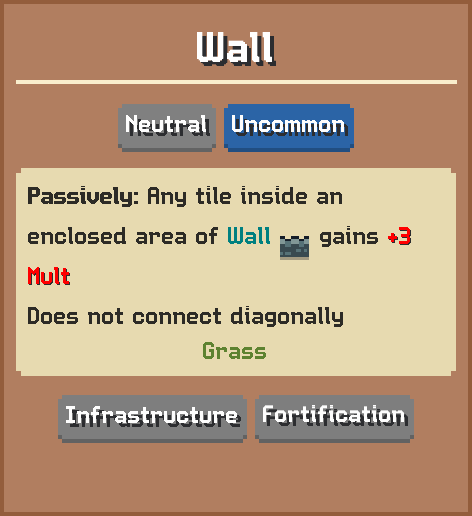

# Wall

Passively: Any tile inside an enclosed area of Wall gains 3 Mult  
Does not connect diagonally

## Basic information

| Field | Value |
| --- | --- |
| Catalog ID | `wall` |
| Game tag | `Wall` (170) |
| Categories | Neutral, Infrastructure, Fortification |
| Rarity | Uncommon |
| Draft group | Neutral |
| Can be placed on | Grass |
| Placement count | 6 |
| Multiplier | 3 |
| Can activate | No |

## Visual references

### Card preview

### Information card

[Catalog icon](icon.png) · [Transparent world sprite](ground.png)

## Related catalog entries

- Affected By Mechanic: Building Draft Rarity Weights
- Affected By Mechanic: Rarity Milestone Multipliers
- Affected By Mechanic: Building Draft Roll Weight
- Affected By Mechanic: Trigger Execution Priority

## Additional reference assets

Terrain context renders (1)

<table>
<tr>
<td align="center" valign="bottom">
 
Grass
</td>
</tr>
</table>

Painted world sprites (1)

<strong>Base sprite</strong>

<table>
<tr>
<td align="center" valign="bottom">
 
Dark
</td>
</tr>
</table>

## Structured source

- [Normalized building record](../../../data/entities/buildings/wall.json)

This page is generated from the normalized catalog record. Runtime-dependent values may vary during a game.
